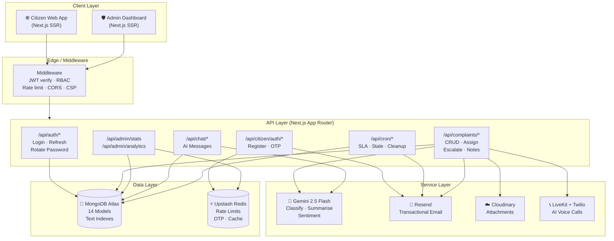
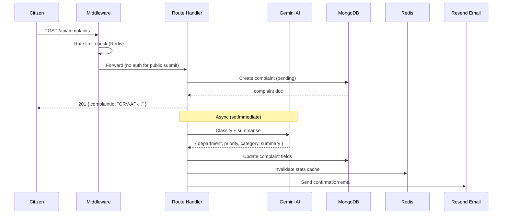
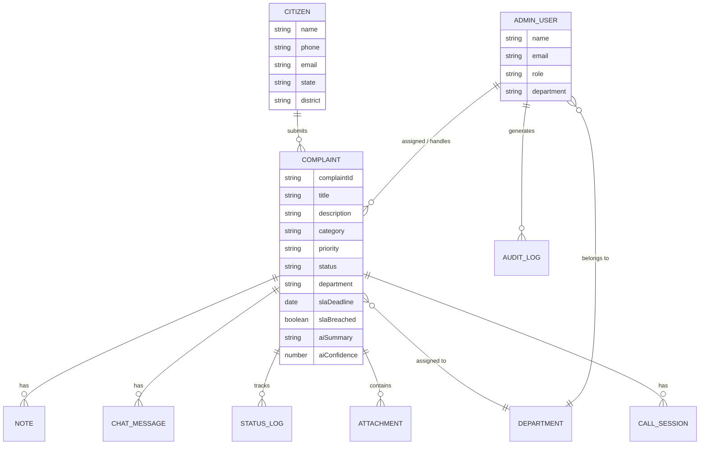
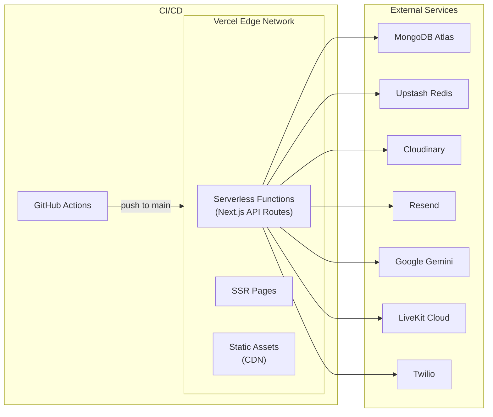

# Architecture Overview

## System Architecture

```mermaid
flowchart TB
    subgraph Client["Client Layer"]
        CW["🌐 Citizen Web App<br/>(Next.js SSR)"]
        AW["🛡️ Admin Dashboard<br/>(Next.js SSR)"]
    end

    subgraph Edge["Edge / Middleware"]
        MW["Middleware<br/>JWT verify · RBAC<br/>Rate limit · CORS · CSP"]
    end

    subgraph API["API Layer (Next.js App Router)"]
        direction LR
        AUTH["/api/auth/*<br/>Login · Refresh<br/>Rotate Password"]
        CAUTH["/api/citizen/auth/*<br/>Register · OTP"]
        COMP["/api/complaints/*<br/>CRUD · Assign<br/>Escalate · Notes"]
        STATS["/api/admin/stats<br/>/api/admin/analytics"]
        CHAT["/api/chat/*<br/>AI Messages"]
        CRON["/api/cron/*<br/>SLA · Stale · Cleanup"]
    end

    subgraph Services["Service Layer"]
        direction LR
        AI["🤖 Gemini 2.5 Flash<br/>Classify · Summarise<br/>Sentiment"]
        EMAIL["📧 Resend<br/>Transactional Email"]
        MEDIA["☁️ Cloudinary<br/>Attachments"]
        VOICE["📞 LiveKit + Twilio<br/>AI Voice Calls"]
    end

    subgraph Data["Data Layer"]
        direction LR
        MONGO[("🍃 MongoDB Atlas<br/>14 Models<br/>Text Indexes")]
        REDIS[("⚡ Upstash Redis<br/>Rate Limits<br/>OTP · Cache")]
    end

    CW --> MW
    AW --> MW
    MW --> API

    AUTH --> MONGO
    CAUTH --> REDIS
    CAUTH --> EMAIL
    COMP --> MONGO
    COMP --> AI
    COMP --> MEDIA
    STATS --> REDIS
    STATS --> MONGO
    CHAT --> AI
    CHAT --> MONGO
    CRON --> MONGO
    CRON --> EMAIL

    COMP --> EMAIL
    COMP --> VOICE
```

## Request Flow

```mermaid
sequenceDiagram
    participant C as Citizen
    participant MW as Middleware
    participant API as Route Handler
    participant AI as Gemini AI
    participant DB as MongoDB
    participant R as Redis
    participant E as Resend Email

    C->>MW: POST /api/complaints
    MW->>MW: Rate limit check (Redis)
    MW->>API: Forward (no auth for public submit)

    API->>DB: Create complaint (pending)
    DB-->>API: complaint doc

    API-->>C: 201 { complaintId: "GRV-AP-..." }

    Note over API,AI: Async (setImmediate)
    API->>AI: Classify + summarise
    AI-->>API: { department, priority, category, summary }
    API->>DB: Update complaint fields
    API->>R: Invalidate stats cache
    API->>E: Send confirmation email
```

## Data Model Relationships

```mermaid
erDiagram
    CITIZEN ||--o{ COMPLAINT : submits
    COMPLAINT ||--o{ NOTE : has
    COMPLAINT ||--o{ CHAT_MESSAGE : has
    COMPLAINT ||--o{ STATUS_LOG : tracks
    COMPLAINT ||--o{ ATTACHMENT : contains
    COMPLAINT }o--|| DEPARTMENT : "assigned to"
    ADMIN_USER }o--|| DEPARTMENT : "belongs to"
    ADMIN_USER ||--o{ COMPLAINT : "assigned / handles"
    ADMIN_USER ||--o{ AUDIT_LOG : generates
    COMPLAINT ||--o{ CALL_SESSION : has

    CITIZEN {
        string name
        string phone
        string email
        string state
        string district
    }

    COMPLAINT {
        string complaintId
        string title
        string description
        string category
        string priority
        string status
        string department
        date slaDeadline
        boolean slaBreached
        string aiSummary
        number aiConfidence
    }

    ADMIN_USER {
        string name
        string email
        string role
        string department
    }
```

## Deployment Topology

```mermaid
graph LR
    subgraph Vercel["Vercel Edge Network"]
        FN["Serverless Functions<br/>(Next.js API Routes)"]
        SSR["SSR Pages"]
        STATIC["Static Assets<br/>(CDN)"]
    end

    subgraph External["External Services"]
        MA["MongoDB Atlas"]
        UR["Upstash Redis"]
        CL["Cloudinary"]
        RS["Resend"]
        GG["Google Gemini"]
        LK["LiveKit Cloud"]
        TW["Twilio"]
    end

    subgraph CI["CI/CD"]
        GH["GitHub Actions"]
        GH -->|push to main| Vercel
    end

    FN --> MA
    FN --> UR
    FN --> CL
    FN --> RS
    FN --> GG
    FN --> LK
    FN --> TW
```
